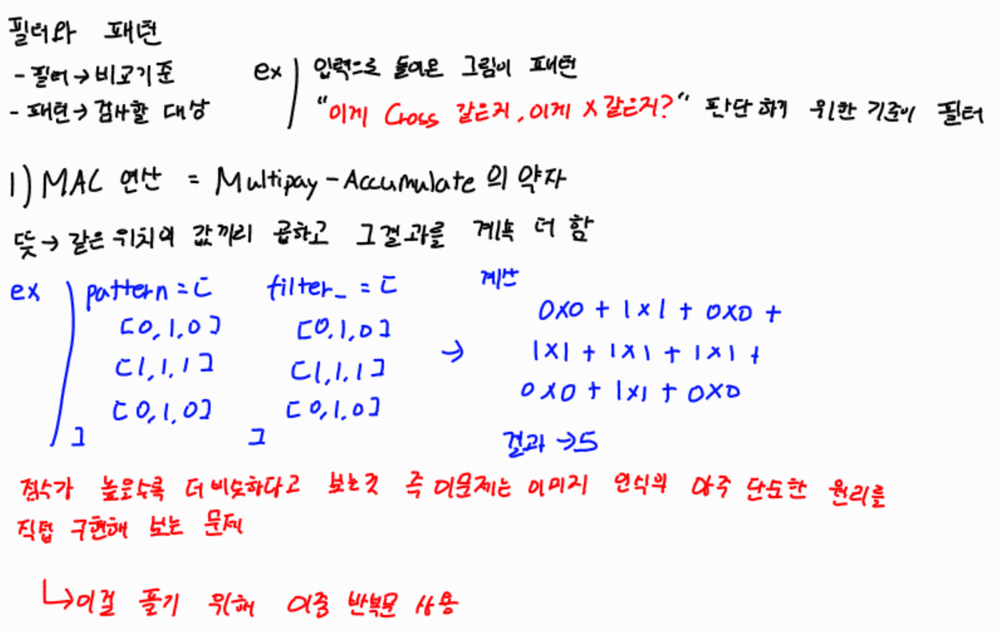
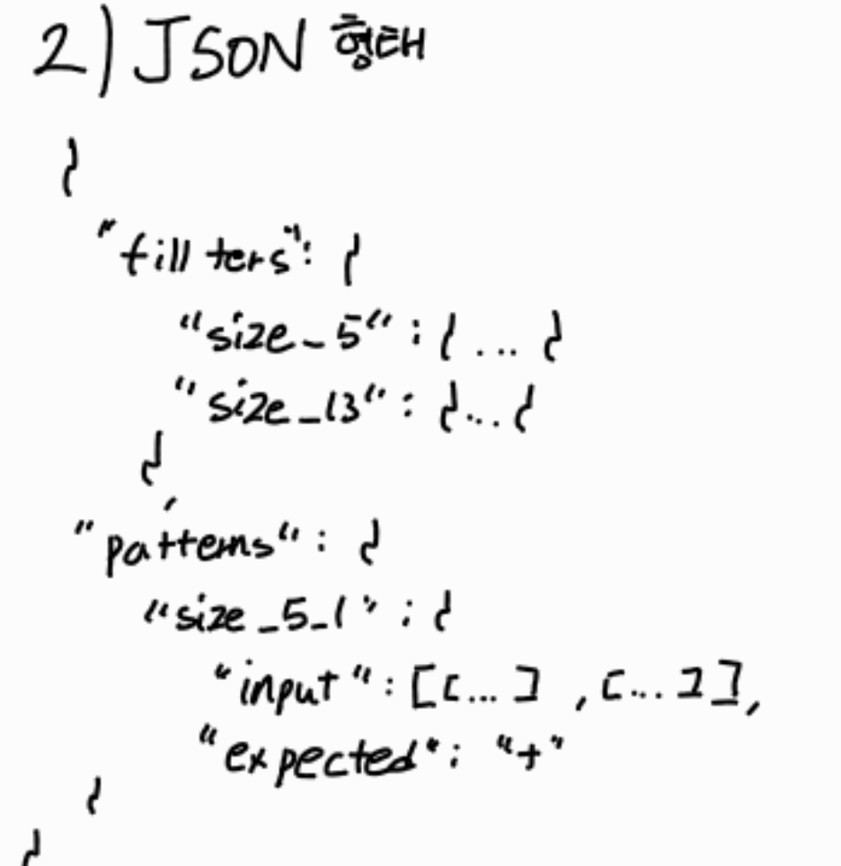
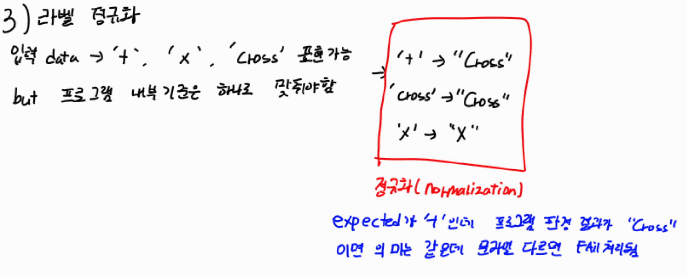
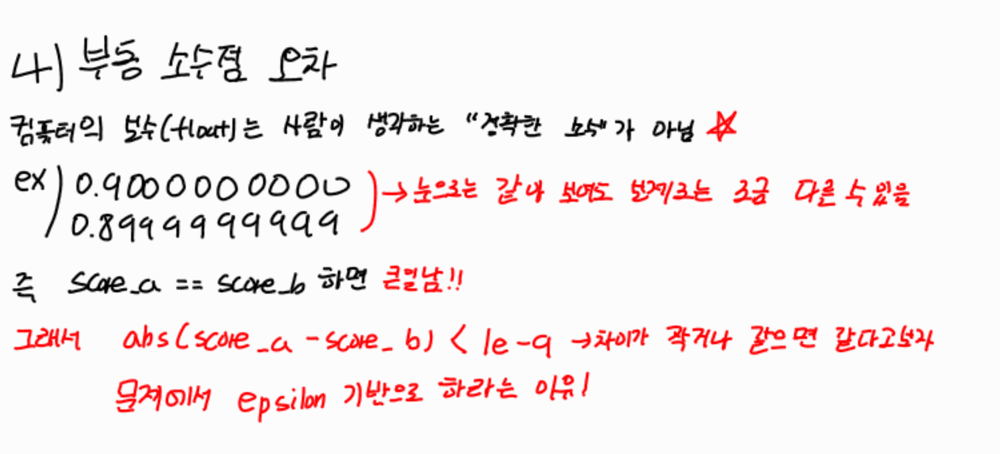

# Mini NPU Simulator

## 문제를 풀기 전 알아야할 요구사항
- 필터와 패턴


- json 형태


- normalization(정규화)


- 부동 소수점


참고 링크: [부동소수점 오차 설명](https://wo-dbs.tistory.com/142)

## 실행 방법

`python main.py`를 실행하면 두 가지 모드 중 하나를 선택할 수 있습니다.

- `1`: 사용자 입력 모드
  - 3x3 필터 A, 필터 B, 패턴을 순서대로 입력합니다.
  - 각 줄은 공백으로 구분된 숫자 3개여야 하며, 형식이 맞지 않으면 재입력을 유도합니다.
- `2`: `data.json` 분석 모드
  - 같은 디렉터리에 있는 `data.json`을 읽어 5x5, 13x13, 25x25 패턴을 일괄 판정합니다.
  - 각 케이스에 대해 점수, 판정, expected 비교 결과를 출력합니다.
  - `data.json` 위치: 프로젝트 루트 `./data.json`

## 구현 요약
- MAC 연산은 `main.py`의 `mac_operation()`에서 이중 반복문으로 구현했습니다.

### 라벨 정규화
- 라벨 정규화는 다음 기준을 사용합니다.
  - expected: `+` -> `Cross`, `x` -> `X`
  - filter key: `cross` -> `Cross`, `x` -> `X`

### MAC 연산 구현 개요
- MAC 연산은 입력 패턴과 필터의 같은 위치 값을 하나씩 곱한 뒤, 그 결과를 모두 더하는 방식으로 구현했다.
- 구현은 `mac_operation()` 함수에서 이중 반복문을 사용해 처리했으며, 외부 라이브러리 없이 직접 계산했다.
- `data.json` 분석 모드에서는 패턴 키(`size_N_idx`)에서 크기를 추출한 뒤, 같은 크기의 `Cross` 필터와 `X` 필터에 대해 각각 MAC 점수를 계산한다.
- 계산된 두 점수를 비교해 최종 판정을 `Cross`, `X`, `UNDECIDED` 중 하나로 결정한다.

### 동점 처리 정책(epsilon)
- 점수 비교는 `abs(score_cross - score_x) < 1e-9`일 때 `UNDECIDED`로 처리합니다.
- JSON 분석 모드는 패턴 키에서 크기(`size_N_idx`)를 추출하고, 해당 `size_N` 필터와 매칭합니다.
- 스키마 오류나 크기 불일치는 예외를 잡아 케이스 단위 `FAIL`로 처리하고 프로그램 전체는 계속 실행되도록 구성했습니다.
- 성능 분석은 I/O를 제외하고 MAC 함수 호출만 10회 반복 측정한 평균 시간(ms)을 출력합니다.

## 성능 측정 방식
- 한 번 반복할 때마다 
  - 시작 시간 기록
  - Cross 필터와 MAC 연산
  - X 필터와 MAC 연산
  - 끝 시간 기록

그 후 `끝 - 시작`으로 한 번 걸린 시간을 구하고 ms로 바꿔 리스트에 저장 10개 시간의 평균을 반환

## 결과 리포트

### FAIL 케이스 원인 분석
``` bash
$ python main.py
=== Mini NPU Simulator ===

[모드 선택]
1. 사용자 입력 (3x3)
2. data.json 분석
선택: 2

#----------------------------------------
[1] 필터 로드
#----------------------------------------
✓ size_5  필터 로드 완료 (Cross, X)
✓ size_13 필터 로드 완료 (Cross, X)
✓ size_25 필터 로드 완료 (Cross, X)

#----------------------------------------
[2] 패턴 분석 (라벨 정규화 적용)
#----------------------------------------
--- size_5_1 ---
Cross 점수: 1.0
X 점수: 1.0
판정: UNDECIDED | expected: Cross | FAIL

--- size_5_2 ---
Cross 점수: 1.0
X 점수: 9.0
판정: X | expected: X | PASS

--- size_13_1 ---
Cross 점수: 25.0
X 점수: 1.0
판정: Cross | expected: Cross | PASS

--- size_13_2 ---
Cross 점수: 1.0
X 점수: 25.0
판정: X | expected: X | PASS

--- size_25_1 ---
Cross 점수: 49.0
X 점수: 1.0
판정: Cross | expected: Cross | PASS

--- size_25_2 ---
Cross 점수: 1.0
X 점수: 49.0
판정: X | expected: X | PASS


#----------------------------------------
[3] 성능 분석 (평균/10회)
#----------------------------------------
크기       평균 시간(ms)    연산 횟수
-------------------------------------
3x3     0.001421         9
5x5     0.003196         25
13x13    0.014283         169
25x25    0.049504         625

#----------------------------------------
[4] 결과 요약
#----------------------------------------
총 테스트: 6개
통과: 5개
실패: 1개

실패 케이스:
- size_5_1: 동점(UNDECIDED) 처리 규칙에 따라 FAIL
```

- 현재 샘플 데이터에서는 `size_5_1` 케이스를 의도적으로 FAIL이 발생하도록 구성했다.
- 이 케이스는 Cross 점수와 X 점수가 모두 `1.0`으로 계산되어 최종 판정이 `UNDECIDED`가 된다. 하지만 `expected` 값은 `+`이며, 프로그램 내부에서는 이를 `Cross`로 정규화해 비교한다.
- 즉 연산이 잘못된 것이 아니라, 동점일 때 `UNDECIDED`로 처리하는 비교 정책 때문에 FAIL이 발생한 사례이다.


### 성능 표 해석 + O(N²) 근거
```bash
#----------------------------------------
[3] 성능 분석 (평균/10회)
#----------------------------------------
크기       평균 시간(ms)    연산 횟수
-------------------------------------
3x3     0.001704         9
5x5     0.004171         25
13x13    0.017392         169
25x25    0.051800         625
```
- MAC 연산은 입력 패턴과 필터의 같은 위치 값을 곱한 뒤 모두 더하는 방식으로 동작한다.
즉 `N x N` 배열의 모든 칸을 한 번씩 방문해야 하므로 필요한 기본 연산 수는 `N^2`이다.
- 따라서 MAC 연산의 시간 복잡도는 `O(N^2)`라고 볼 수 있다.

- 성능 분석 결과에서도 이 경향을 확인할 수 있다. `3x3`은 9회, `5x5`는 25회, `13x13`은 169회, `25x25`는 625회의 곱셈-누적 연산이 필요하다.
- 실행 환경에 따라 절대 시간은 달라질 수 있지만, 배열 크기가 커질수록 평균 연산 시간이 전반적으로 증가하는 흐름을 볼 수 있다.
